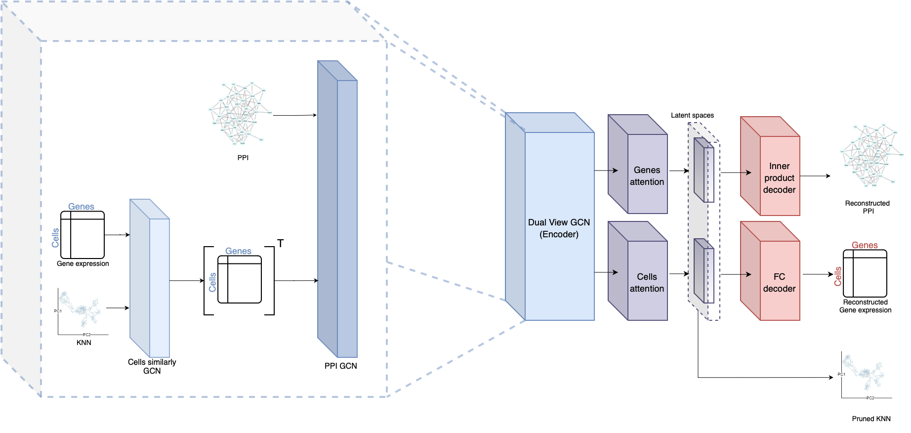

# **scNET: Learning Context-Specific Gene and Cell Embeddings by Integrating Single-Cell Gene Expression Data with Protein-Protein Interaction Information**

## **Overview**

Recent advances in single-cell RNA sequencing (scRNA-seq) techniques have provided unprecedented insights into tissue heterogeneity. However, gene expression data alone often fails to capture changes in cellular pathways and complexes, which are more discernible at the protein level. Additionally, analyzing scRNA-seq data presents challenges due to high noise levels and zero inflation. In this study, we propose a novel approach to address these limitations by integrating scRNA-seq datasets with a protein-protein interaction (PPI) network. Our method employs a unique bi-graph architecture based on graph neural networks (GNNs), enabling the joint representation of gene expression and PPI network data. This approach models gene-to-gene relationships under specific biological contexts and refines cell-cell relations using an attention mechanism, resulting in new gene and cell embeddings. We provide comprehensive evaluations to demonstrate the effectiveness of our method.

## Download via Git

To clone the repository, use the following command:
git clone https://github.com/madilabcode/scNET

We recommend using the provided Conda environment located at ./Data/scNET-env.yaml.
cd scNET
conda env create -f ./Data/scNET-env.yaml

## Tutorial

### We recommend using the Google Colab framework for running scNET. Our method works with a Scanpy AnnData object and provides the following outputs:

New cell embeddings
New gene embeddings
The trained model
Pruned KNN network

### For a basic usage example of our framework, please refer to the following notebook:
[scNET Example Notebook](https://colab.research.google.com/github/madilabcode/scNET/blob/main/scNET.ipynb)
The provided tutorial includes instructions on how to clone the Git repository to your Google Drive, run the model, and load the outputs.
